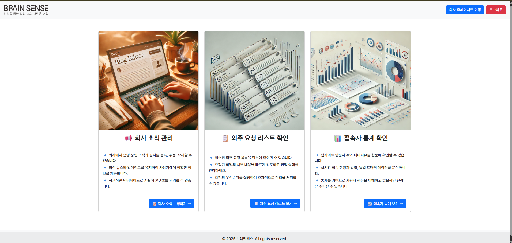
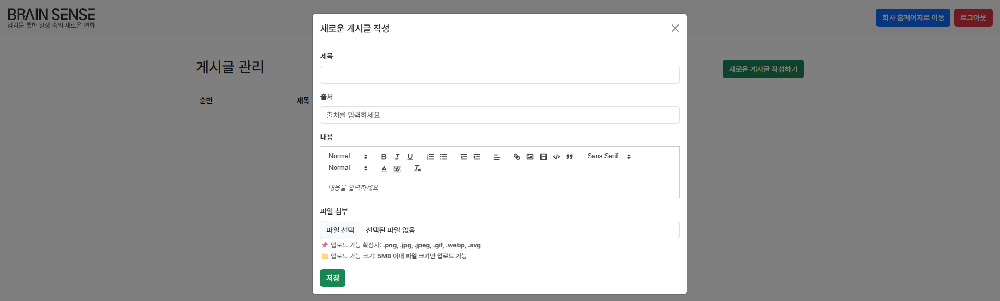
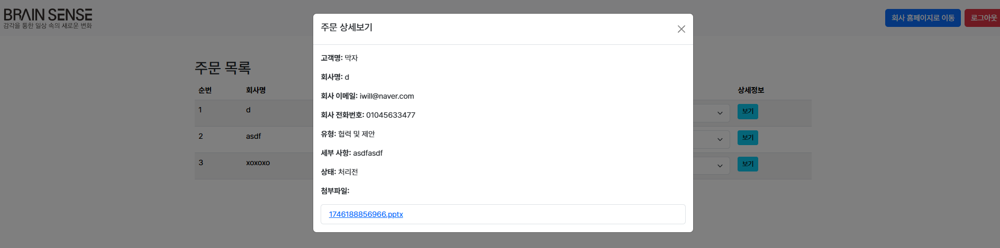

# Brainsense Admin  
🚀 스타트업 홈페이지 **관리자 전용 페이지** 개발 프로젝트

---

## 🏢 프로젝트명  
브레인센스 관리자 페이지 제작

---

## 📌 프로젝트 개요  

**진행 기간:** 2025년 1월 ~ 2025년 3월 초  

브레인센스 스타트업의 홈페이지 운영을 위한 **관리자 전용 인터페이스**입니다.  
Node.js 기반의 백엔드와 EJS 템플릿 엔진을 사용하여 서버 사이드 렌더링을 지원하며,  
MongoDB Atlas(클라우드 DB)를 통해 데이터 관리 및 안정성을 확보했습니다.  

- **프로젝트 배경**: 스타트업의 브랜드/서비스 홍보와 효율적인 관리 요구 해결  
- **목표**: 관리자 계정, 주문, 뉴스 게시글을 안전하게 관리하는 통합 플랫폼 제공  
- **팀 구성**:  
  - 디자이너 1명  
  - 프론트엔드 개발자 2명  
  - 백엔드 개발자 2명 (**본 리포지토리 담당**)  
  - 대표(총괄) 1명  

---

## 🚀 주요 기능  

- **관리자 회원가입 및 인증 (3단계 보안 절차)**  
  - 이메일 소유 인증 → 최고 관리자 승인 요청 → 최종 승인  
  - 무분별한 관리자 계정 생성을 차단해 보안 강화  

- **주문 처리 기능**  
  - 외주 요청 / 1:1 문의 접수 및 조회  
  - 상태 변경 (대기 ↔ 처리완료)  

- **뉴스 게시 기능**  
  - 공지사항 및 뉴스 게시글 등록, 수정, 삭제  
  - **Quill.js 리치 텍스트 에디터**로 편리한 콘텐츠 작성 지원  

- **구글 애널리틱스 연동**  
  - 관리자 대시보드에서 방문자 통계/사용자 행동 분석  

---

## 📷 시스템 아키텍처  

**사진1: 시스템 플로우 다이어그램**  
  

> 클라이언트 페이지와 관리자 페이지는 동일한 MongoDB 인스턴스를 공유합니다.  
> 관리자 페이지는 주문/뉴스/사용자 관리를 담당하며, 파일은 **Google Cloud Storage**에 보관됩니다.  

---

## 🏠 주요 화면  

- **사진2: 관리자 홈 화면**
    
  > 로그인 후 주요 통계를 한눈에 확인  

- **사진3: 뉴스 등록 화면**
    
  > 제목, 본문, 이미지 업로드 지원  

- **사진4: 주문 관리 화면**
    
  > 접수된 1:1 문의 목록 조회 및 상태 변경  

---

## 📚 사용된 기술 스택  

### **Backend (Admin Server)**  
- **Node.js + Express.js** → 경량 서버 구축  
- **MongoDB Atlas + Mongoose** → 클라우드 데이터베이스, ODM 매핑  
- **인증/보안**:  
  - `jsonwebtoken (JWT)` → 세션리스 인증  
  - `bcryptjs` → 비밀번호 해시 암호화  
  - `httpOnly` 쿠키 → 토큰 탈취 방지  
- **파일 관리**:  
  - `multer` → 업로드 처리  
  - `@google-cloud/storage` → 파일을 GCS에 저장  
- **이메일 전송**: `nodemailer` (Gmail SMTP)  
- **템플릿 엔진**: `EJS`  
- **기타**: `dotenv`, `cookie-parser`, `cors`  

---

## ✨ 프로젝트의 특징

1. **보안성** – 3단계 관리자 인증 절차로 불법 계정 생성 차단  
2. **확장성 있는 파일 관리** – GCS 기반 파일 저장으로 서버 부담 최소화  
3. **모듈화된 구조** – 미들웨어/라우트 분리로 유지보수성 향상  
4. **편리한 관리자 UX** – Quill.js 에디터 + 비동기 통신으로 원활한 사용 경험  

---

## 📝 핵심 로직 발췌  

### 서버 라우트 구조 (`adminServer.js`)  
```js
// Public routes
app.use('/signup', adminRegister);
app.use('/admin', adminApprove);
app.use('/admin', adminLogin);

// Private routes (인증 필요)
app.use(loginAuthMiddleware);
app.get('/main', (req, res) => {
  res.render('admin_main', { admin: req.admin });
});
app.use(postRoutes);
app.use(orderRoutes);
```

### JWT + httpOnly 쿠키 로그인 (`adminLogin.js`)  
```js
const token = jwt.sign({ adminId: admin._id }, process.env.JWT_SECRET, { expiresIn: '1h' });
res.cookie('token', token, {
  httpOnly: true,
  secure: false, // HTTPS 환경에서 true
  maxAge: 60 * 60 * 1000
});
```

### Google Cloud Storage 업로드 (postRoutes.js)
```js
async function uploadFileToGCS(fileBuffer, filename) {
  const bucket = storageClient.bucket(GCLOUD_BUCKET);
  const destination = `news/${filename}`;
  await bucket.file(destination).save(fileBuffer, { public: true });
  return `https://storage.googleapis.com/${GCLOUD_BUCKET}/${destination}`;
}
```

### **2. 관리자 보안: 3단계 인증 절차**

이 프로젝트는 단순히 아이디와 비밀번호만으로 관리자를 생성하지 않습니다.  
**이메일 소유 인증 → 최고 관리자의 승인 요청 → 최종 승인**  
이라는 체계적인 3단계 절차를 통해 인가된 사용자만이 관리자 권한을 가질 수 있도록 설계되었습니다.

---

#### → 1단계: 이메일 인증 (Email Verification)

```jsx
// middlewares/emailAuth.js

// 1. 임시 인증 코드를 저장할 Map 객체
const verificationCodes = new Map();

// 2. 인증 코드 생성 및 이메일 발송 함수
const sendVerification = async (req, res) => {
  // ... (중복 이메일 체크) ...

  // 6자리 난수 코드 생성
  const code = Math.floor(100000 + Math.random() * 900000).toString();
  
  // 메모리에 이메일과 코드를 5분간 저장
  verificationCodes.set(email, code);
  setTimeout(() => {
    verificationCodes.delete(email);
  }, 5 * 60 * 1000); // 5분 후 자동 삭제

  // Nodemailer를 통해 인증 코드 발송
  await smtpTransport.sendMail(mailOptions);
  res.status(200).json({ message: '이메일 인증 요청이 전송되었습니다.' });
};
```
#### → 2단계: 관리자 승인 요청 (Approval Request)

```jsx
// middlewares/registerMail.js

const registerAdmin = async (req, res) => {
  // ... (가입 정보 유효성 검사) ...

  const newAdmin = new Admin({
    // ... (사용자 정보)
    approved: false, // 📌 초기 상태는 '미승인'
  });

  await newAdmin.save(); // DB에 미승인 상태로 저장

  // 최고 관리자에게 승인 요청 이메일 전송
  const adminEmail = process.env.ADMIN_EMAIL;
  const mailOptions = {
    from: process.env.MAIL_USER,
    to: adminEmail,
    subject: '새로운 관리자 회원가입 요청',
    html: `<p>새로운 관리자 가입 요청</p>
           ...
           <a href="http://localhost:8081/admin/approve?email=${email}">승인하기</a>`,
  };

  await smtpTransport.sendMail(mailOptions);
};
```
#### → 3단계: 최종 승인 (Final Approval)
```jsx
// routes/adminApprove.js

router.get('/approve', async (req, res) => {
  try {
    const { email } = req.query;

    // 해당 이메일 사용자를 찾아 'approved' 상태를 true로 업데이트
    const updatedAdmin = await Admin.findOneAndUpdate(
      { email },
      { approved: true },
      { new: true }
    );

    // 승인된 관리자에게 최종 안내 이메일 전송
    const mailOptions = {
      from: process.env.MAIL_USER,
      to: email,
      subject: '관리자 계정 승인 완료',
      html: `<p>귀하의 관리자 계정이 승인되었습니다. 이제 로그인 할 수 있습니다.<p>`,
    };
    await smtpTransport.sendMail(mailOptions);

    res.render('admin_approve', { email }); // 승인 완료 페이지
  } catch (error) {
    // ... (에러 처리)
  }
});
```


